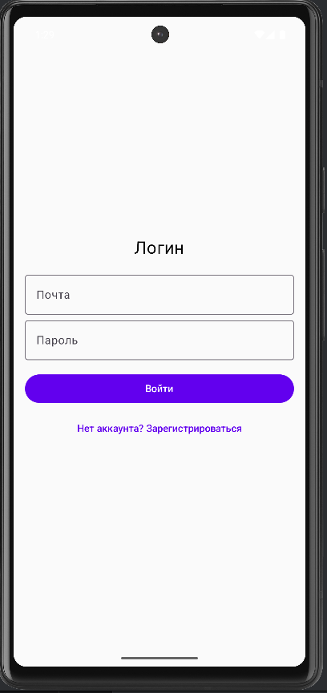
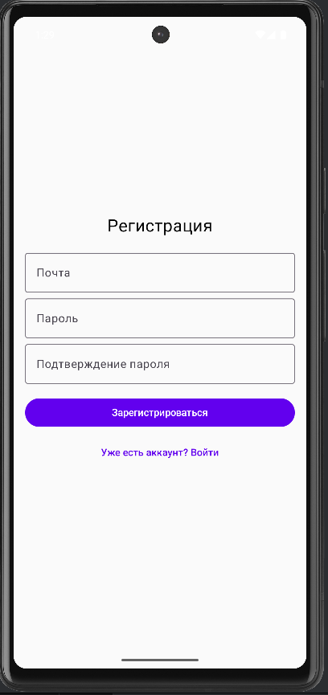
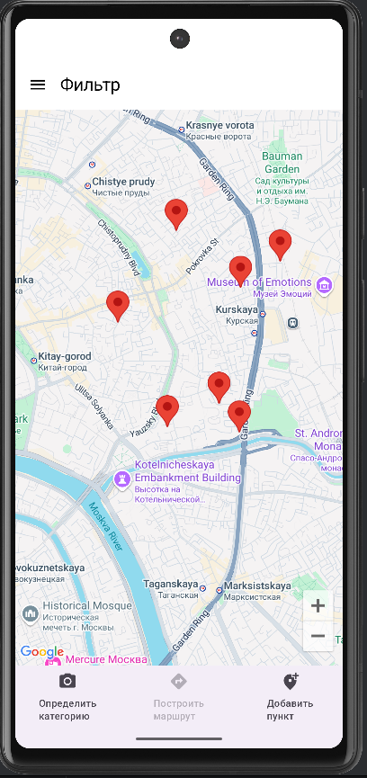
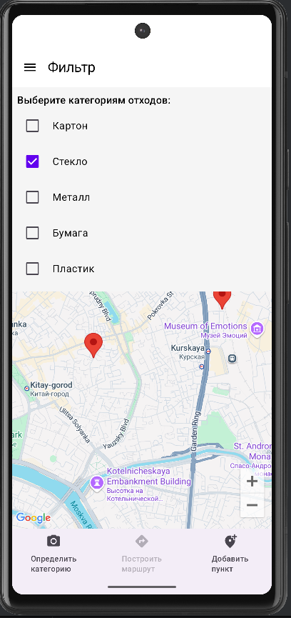
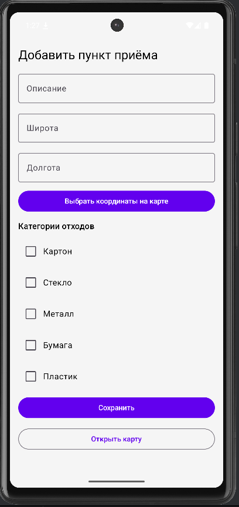
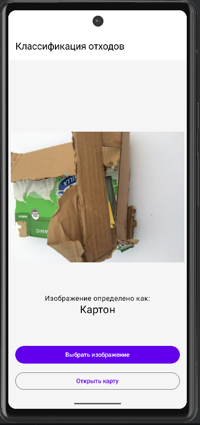
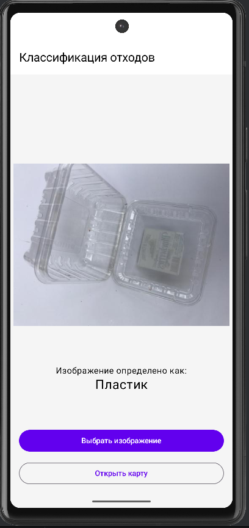

# RecycleApp

Приложение для добавления и отображения пунктов приёма перерабатываемых отходов. 
Поддерживает авторизацию, работу с картой и классификацию отхода с помощью модели машинного обучения.
Этот проект использует модель для классификации отходов на основе датасета [Trashnet](https://www.kaggle.com/datasets/feyzazkefe/trashnet/data)
из работы [Pruning and Quantization in Keras](https://www.kaggle.com/code/sumn2u/pruning-and-quantization-in-keras/notebook), лицензия [Apache License 2.0](https://www.apache.org/licenses/LICENSE-2.0).

TrashNet — датасет изображений, включающий 6 классов: картон, стекло, металл, бумага, пластик и другое.
Используемая модель классифицирует изображения отходов с использованием сверточной нейронной сети, обученной на датасете TrashNet.
В процессе её создания применены техники оптимизации — обрезка (pruning) и квантование (quantization), 
из-за чего удалось значительно уменьшить размер модели и ускорить её выполнение.
Модель экспортирована в формат TensorFlow Lite, что позволяет использовать её на мобильных устройствах.

## Функциональность

- Определение категории отхода по его изображению (картон, стекло, металл, бумага, пластик)
- Карта пунктов приёма с возможностью фильтрации по категории отхода 
- Авторизация по почте и паролю
- Добавление пунктов приёма отходов для авторизированных пользователей

## Скриншоты
### Авторизация

### Регистрация

### Карта

### Управление пунктами

### Классификация отходов

### Запись работы

 

## Установка

Скачать APK по [ccылке](https://github.com/ArtemPolushin/RecycleApp/releases/download/v1.0.0/app.apk)
